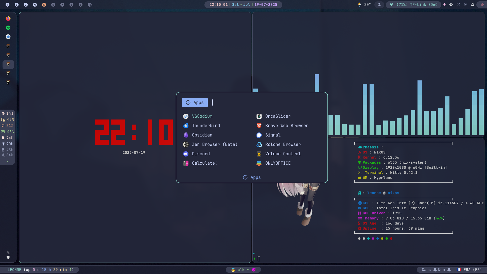
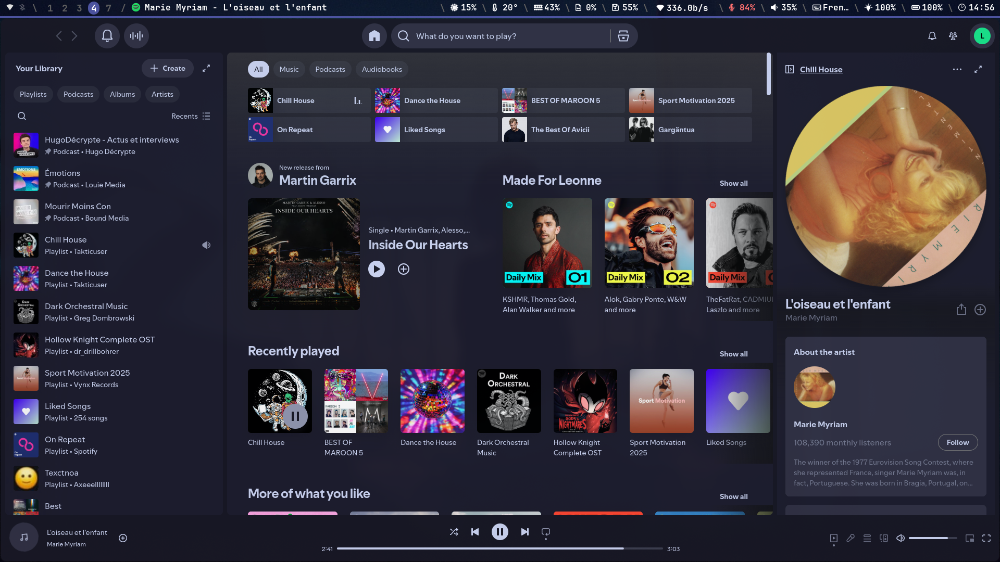
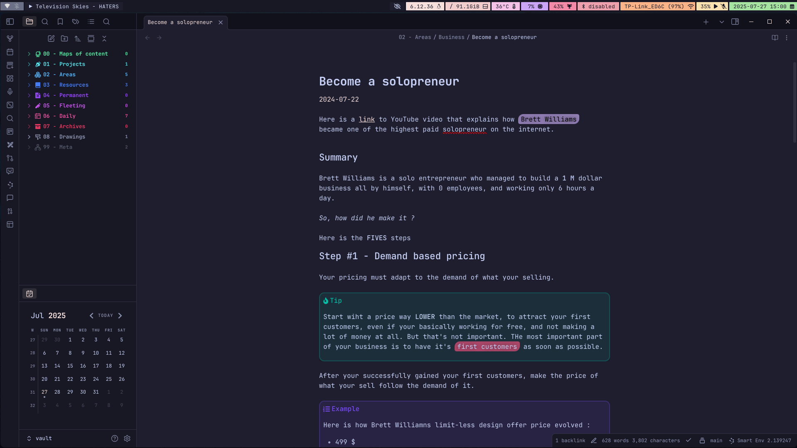

<div align="center"></div>
<h1 align="center">NixOS & Hyprland Config</h1>

<div align="center">


<br>


</div>

## Table of Contents

- [Table of Contents](#table-of-contents)
- [🌟 Showcase](#-showcase)
- [❤️ Thanks](#️-thanks)
- [📖 About](#-about)
- [✨ Features](#-features)
- [📦 Content](#-content)
- [🐟 Useful aliases in Fish Shell](#-useful-aliases-in-fish-shell)
- [🤖 AI Tools and Services](#-ai-tools-and-services)
- [🛠️ Developement Environment](#️-developement-environment)
- [🔧 Components](#-components)
- [⌨️ Keybindings](#️-keybindings)
- [🚀 Installation](#-installation)
- [📝 Tips \& Tricks](#-tips--tricks)
  - [Discord](#discord)
  - [Home Manager](#home-manager)
  - [Change MAC address](#change-mac-address)
  - [Show battery status](#show-battery-status)
  - [How to Reset Your OpenWebUI Password](#how-to-reset-your-openwebui-password)
  - [Night mode switch](#night-mode-switch)
  - [Install VSCode Extensions](#install-vscode-extensions)
    - [Manual](#manual)
    - [Automatic](#automatic)
    - [With Extensions](#with-extensions)
  - [Printing \& Scanning](#printing--scanning)
    - [Printing](#printing)
  - [Scanning](#scanning)
- [📜 License](#-license)


## 🌟 Showcase



<details>
<summary>More screenshots</summary>




</details>
<br>

> [!NOTE]
>
> More comming soon (or not) ...

## ❤️ Thanks

First of all, a big Thank to [**XNM1**](https://github.com/XNM1) for his incredible [NixOS
Configuration](https://github.com/XNM1/linux-nixos-hyprland-config-dotfiles), which was a
**massive** inspiration for my own.

**Go CHECKOUT his config if you want to see the full details !!**

> [!NOTE]
>
> This README is also inspired of his, modified to match my configuration details for
> **Keybindings**, **Softwares** and **Aliases**
>
> However, it also adds more custom and specific informations

Other inspirations (*not exhaustive, but those I could remember and/or find back*)

- Sioodmy - [dotfiles](https://github.com/sioodmy/dotfiles)
- DarkKronicle - [nazarik](https://github.com/DarkKronicle/nazarick)
- DrTheodor - [nixos-dotfiles](https://github.com/DrTheodor/nixos-dotfiles)
- JaKooLit - [NixOS-Hyprland](https://github.com/JaKooLit/NixOS-Hyprland)
- ryan4in - [nix-config](https://github.com/ryan4yin/nix-config)
- end-4 - [dots-hyprland](https://github.com/end-4/dots-hyprland)

*and probably many others*

**THANKS to all of them for there incredible configurations I took pleasure to admire, read and
understand**

## 📖 About

This repository houses my NixOS 🐧 Linux ❄️ flake configuration

> [!NOTE]
>
> It's essential to note that this configuration is not minimalistic or lightweight and may require
> some disk space and knowledge to understand.

This system leverages cutting-edge channels and versions of software to provide the latest updates
and features. Notably, it utilizes:

- **flake** (An experimental feature of the Nix package manager)
- **nixpkgs**: unstable
- **home-manager**: To setup user environment

## ✨ Features

- 🔄 **Reproducible**: Built on NixOS, this configuration can be effortlessly reproduced on other
  machines, ensuring a consistent setup.

- ✅ **Complete**: This system is equipped with a wide range of components and utilities, akin to the
  completeness of operating systems like MacOS or Windows.

- 📖 **Documented**: Most of the parts of my configuration files are commented and documented with
  links and explanations if necessary

## 📦 Content

In this repository, you'll find my :

- Dotfiles - in [`/home/config`](./home/config/)
- Nix configuration files - in [`/system/modules`](./system/modules/)
- Home-manager configuration files - in [`/home/user`](./home/user/)

## 🐟 Useful aliases in Fish Shell

This system includes a fish shell configuration file ([`config.fish`](home/config/fish/config.fish))
that provides various aliases to enhance my experience.

Common commands:
- `cl`: clear the terminal screen (shorthand for `clear`)
  - `c`: because I have no time to waste (*sure ...*)
  - `cls`: because I spent to much time using the devil (**Windows**)
- `lgit`: launch the `lazygit` command-line Git client
- `ldocker`: launch the `lazydocker` command-line Docker client
- `open`: open file with default programm (`open-xdg`)

Git:

- `ga`: alias for `git add . -A`
- `gs`: alias for `git status`
- `gl`: alias for `git log --all --color --decorate --oneline --graph`

NixOS-specific commands:

- `rebuild`: rebuild your system using the current flake
- `ngc`: delete all old generations of user profiles (equivalent `sudo nix-collect-garbage -d`)
- `npw`: wipe system history


And many others ...

| Alias   | Description                                                   |
| ------- | ------------------------------------------------------------- |
| `clk`   | Launches `rsclock` in color mode.                             |
| `tree`  | Runs `tre` with extended mode. (`tre -e`)                     |
| `ls`    | Enhanced `ls` using `eza` with colors, Git info, icons, etc.  |
| `ll`    | Lists all files including hidden in detailed view. (`ls` -la) |
| `cd`    | Uses `z` for smarter directory jumping.                       |
| `ps`    | Uses `procs`, a modern replacement for `ps`.                  |
| `man`   | Uses `tldr` for simplified man pages.                         |
| `du`    | Uses `dust` for better disk usage display.                    |
| `mkdir` | Creates parent directories as needed. (`mkdir -p`)            |
| `home`  | Goes to home directory. (`cd ~`)                              |
| `vi`    | Opens current directory in `nvim`. (`nvim .`)                 |
| `cat`   | Uses `bat` for syntax-highlighted file viewing.               |
| `df`    | Uses `duf` for modern disk usage info.                        |
| `hex`   | Displays binary files in hexadecimal format. (`hexyl`)        |
| `dua`   | Opens interactive disk usage analyzer. (`dua -i`)             |
| `code`  | Opens current directory in VSCodium. (`codium .`)             |


## 🤖 AI Tools and Services

This configuration includes several AI/LLM tools and services for local development and
experimentation:


**Ollama** - Local LLM server with pre-loaded models:
- Accessible at `http://localhost:11434`
- Models: `llama3.2:3b`, `deepseek-r1:1.5b`, `dolphin3:8b`,
- Text embedding model: `nomic-embed-text`

**AI Tools:**
- `aichat` - ChatGPT-like CLI and REPL with lot of features
- `aider-chat` - Code assistant/chat directly in the terminal
- `alpaca` - GUI LLM client with markdown support
- `fabric-ai` - An open-source framework for augmenting humans using AI

## 🛠️ Developement Environment

> [!NOTE]
>
> I mainly code in Python, C / C++, Typescript / Javascript and some basic HTML, CSS, but I would
> like to learn and use Go.
>
> I also regularly use Markdown and Latex for documents editing.

To set up my different developement environments, I use `flake.nix` with those great
[templates](https://github.com/the-nix-way/dev-templates/) as a starting point, that I then extend
to my needs.

It provides a local, consistent and reproducible environment for each project in every programming /
scripting language, and I find it the most practical way to get things done.

> [!IMPORTANT]
>
> It works particularly well for C / C++ projects where I need to use libraries like SFML, SDL or
> Dear ImGUI, because it would be a **PAIN** to setup otherwise.

I also [direnv](https://direnv.net/) to automatically load the developement environement in the
shell when I'm in the directory (do `direnv allow` in the project directory to make it happen).

> [!TIP]
>
> There are also the [devenv](https://devenv.sh/) and [devbox](https://www.jetify.com/devbox)
> projects that are even simplier to work with and configure when beginning.

## 🔧 Components

Here is a list of every components that I use on my system to perform the various tasks of a modern
OS.

| Component            | Name                                   |
| -------------------- | -------------------------------------- |
| Distro               | NixOS                                  |
| Shell                | Fish                                   |
| Display Server       | Wayland                                |
| WM (Compositor)      | Hyprland                               |
| Bar                  | Waybar                                 |
| Notification         | Dunst                                  |
| Launcher             | Rofi-Wayland                           |
| Editor               | Helix, Nvim (with `nvf`), VSCodium     |
| Terminal             | Kitty + Starship                       |
| OSD                  | Avizo                                  |
| Night Gamma          | Hyprsunset                             |
| Fetch Utility        | Neofetch, Fastfetch, Onefetch          |
| Theme                | Catppuccin Macchiato                   |
| Icons                | Numix-Circle                           |
| Font                 | JetBrains Mono + Nerd Font Patch       |
| Player               | Spotify + Spicetify + VLC              |
| File Browser         | Nemo + Yazi                            |
| Internet Browser     | Firefox, Zen Browser, Brave (chronium) |
| Private Browser      | Tor Browser                            |
| Calculator           | qalculate-gtk (GUI) + libqalculate     |
| Mimetypes            | MPV, Imv, Zathura                      |
| Image Editor         | Swappy                                 |
| Screenshot           | Grim + Slurp                           |
| Recorder             | OSB Studio                             |
| Clipboard            | Wl-clipboard + Cliphist                |
| Idle                 | Hypridle                               |
| Lock                 | Hyprlock                               |
| Logout menu          | Wlogout                                |
| Wallpaper            | Hyprpaper                              |
| Graphical Boot       | Plymouth + Catppuccin-plymouth         |
| Display Manager      | SDDM                                   |
| Containerization     | Podman & Docker                        |
| Terminal Multiplexer | Zellij                                 |
| Office Suite         | OnlyOffice                             |
| Email Client         | Thunderbird                            |
| Notetaking           | Obsidian                               |
| Messaging            | Discord + Signal + Telegram            |
| Image Editing        | GIMP + Inkspace                        |
| Backup               | Rclone                                 |
| 3D Slicer            | Orca Slicer                            |

## ⌨️ Keybindings

Here you'll find all my Hyprland specific keyboard shortcuts.

> [!NOTE]
>
> As I'm currently using a Dell Laptop as my main computer, I do use the "Windows" home key as a
> SUPER.
>
> I'm also using the special `Print` key for screenshots related actions

| Key Combination           | Action                                        |
| ------------------------- | --------------------------------------------- |
| SUPER + SHIFT + Arrows    | Resize windows                                |
| SUPER + ALT + Arrows      | Move windows                                  |
| SUPER + H, J, K, L/Arrows | Change window focus                           |
| SUPER + 1..0              | Change workspace (1-10)                       |
| SUPER + SHIFT + 1..0      | Move window to workspace (1-10)               |
| SUPER + M                 | Switch to special workspace                   |
| SUPER + SHIFT + M         | Move window to special workspace              |
| SUPER + Q / ALT + F4      | Kill active window                            |
| SUPER + W                 | Toggle floating window                        |
| ALT + Return / Enter      | Toggle full-screen                            |
| SUPER + O                 | Toggle split                                  |
| SUPER + P                 | Toggle pseudo                                 |
| SUPER + T                 | Launch `kitty`                                |
| SUPER                     | Launch `rofi -drun`                           |
| SUPER + F                 | Launch `firefox`                              |
| SUPER + E                 | Launch `thunar`                               |
| SUPER + ESCAPE / ALT + M  | Launch `wlogout`                              |
| SUPER + S                 | Launch `spotify`                              |
| SUPER + D                 | Launch `discord`                              |
| SUPER + A                 | Launch `ags`                                  |
| ALT + L                   | Launch `hyprlock`                             |
| SUPER + B                 | Launch `btop`                                 |
| PRINT                     | Take screenshot                               |
| ALT + Print               | Launch `swappy` to edit last taken screenshot |
| SUPER + C                 | Launch color picker (using `pyprland`)        |
| SUPER + Z                 | Toggle Zoom (with `pyprland`)                 |
| SUPER + V                 | Launch clipboard menu (`rofi -dmenu`)         |
| SUPER + I                 | Toggle night mode                             |
| ALT / ALT + TAB           | Switch window menu                            |
| SUPER + CTRL + Arrows     | Move to next / previous workspace             |
| CTRL + ALT + A            | Reloads `ags` config                          |
| CTRL + ALT + W            | Reloads `waybar` config                       |
| SUPER + Space             | Launch `zellij` inside `kitty`                |
| SHIFT 1..4                | Change Waybar Theme (`waybar-theme`)          |

You can find all other keybindings in `/home/config/hypr/hyprland.conf` in the bind section. All
system fish scripts are located at `/home/config/fish/functions` directory.

## 🚀 Installation

> [!NOTE]
>
> This section is mostly for my personal use, but feel free to use it if you want to.

#TODO

## 📝 Tips & Tricks

> [!NOTE]
>
> This section mostly contains fixes and tips related to issues that I have encountered while
> configuring NixOS

### Discord

When launching Discord for the first time with my current configuration, it will crash because
OpenASAR can't find the Discord config files. To fix this issue, just launch Discord a first time as
a standalone program before running it the usual way.

```bash
nix run --impure nixpkgs\#discord
```

### Home Manager

If problems arise when switching to new configuration, you can see home-manager's related errors
with the following command

```bash
journalctl -u home-manager-leonne.service -b
```

### Change MAC address

```bash
sudo ifconfig wlan0 down
sudo macchanger -m 24:95:2f:d2:bc:79 wlan0
sudo ifconfig wlan0 up
```

### Show battery status

To enumerate all power devices, execute

```bash
upower --enumerate
```

Then to show unformation on the battery (for example)

```bash
upower -i (upower --enumerate | grep battery)
```

### How to Reset Your OpenWebUI Password

For detailed instructions, please refer to [this link](https://docs.openwebui.com/troubleshooting/password-reset/).

The database is stored in the directory `/var/lib/open-webui`.

In my experience, the most straightforward solution was to delete the database entirely:

```bash
sudo rm -rf /var/lib/open-webui/webui.db
```

### Night mode switch

```bash
hyprsunset --temperature 2500
```

or

```bash
hyprsunset --help  # To see all avaible commands
```

### Install VSCode Extensions

#### Manual

On machine A

```bash
code --list-extensions | xargs -L 1 echo code --install-extension > install-vscode-extensions.sh
```

On machine B

```bash
chmod +x install-vscode-extensions.sh
./install-vscode-extensions.sh
```

#### Automatic

Use the built-in [`Settings Sync`](https://aka.ms/vscode-settings-sync-help) functionality of VSCode.

#### With Extensions

- [**Syncing**](https://github.com/nonoroazoro/vscode-syncing/tree/master/src/core) (*works great*) - Sync all of your VSCode settings across multiple devices
- [**local sync**](https://github.com/AnWeber/vscode-local-sync) - Sync your settings to a local directory

### Printing & Scanning

#### Printing

> [!NOTE]
> If you're connected to a printer via USB, you may first verify that the printer is detected by the system using the command `lsusb`.

First, configure printing in NixOS following the [wiki](https://wiki.nixos.org/wiki/Printing).

Then, to list all available printers, use the following command:

```bash
lpstat -a
```

> [!CAUTION]
> If you don't see any printers, you may need to install the printer drivers. For example, for a Canon printer, you may need to install `cnijfilter2`.
>
> Then to add the printer, go to the CUPS web interface at `https://127.0.0.1:631` and add the printer manually.

To print a document from the terminal, use the following command:

```bash
lp -P <printer-name> <file-name>
```

### Scanning

First, configure scanning in NixOS following the [wiki](https://wiki.nixos.org/wiki/Scanners).

To scan a document from the terminal, use the following command:

```bash
scanimage --device <your-device> --format=png > output.png
```

> [!TIP]
>
> You can use `scanimage -L` to list all available scanners.

## 📜 License

This project is licensed under the MIT License - see the [LICENSE](LICENSE) file for details.
