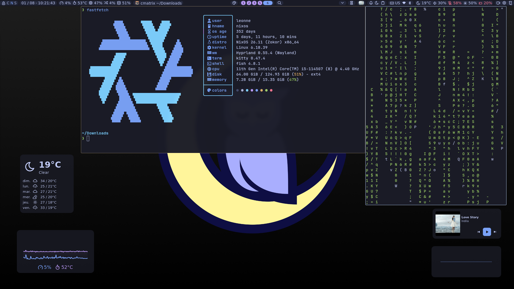

<!-- markdownlint-disable MD033 -->
<!-- markdownlint-disable MD041 -->

<div align="center">


# ❄️ NixOS Configuration ❄️


My current [NixOS](https://nixos.org/) and
[Home Manager](https://github.com/nix-community/home-manager/) configurations
</div>



## 📖 About

This repository houses my current [NixOS](https://nixos.org/) and
[Home Manager](https://github.com/nix-community/home-manager/) configurations,
using [**Hyprland**](https://hypr.land/) and [**Noctalia Shell**](https://noctalia.dev/),
with full-disk encryption.

You can learn more about this config by consulting my [notes](./docs) on the matter.

## 📦 Structure

> [!warning]
> TO BE CONTINUED ...

- [devshells](./devshells) - Development shells
- [docs](./docs) - Personnal config documentation
- [home](./home) - Home-Manager config
- [hosts](./hosts) - All machines / targets
- [lib](./lin) - Custom librairies and functions
- [modules](./modules) - All modules
- [packages](./packages) - All custom packages

## ❄️ Flake outputs

```bash
❯ nix flake show
├───devShells
│   └───x86_64-linux
│       ├───my-nix-env: development environment 'nix-shell'
│       └───my-python-env: development environment 'nix-shell'
├───formatter
│   └───x86_64-linux: package 'nixfmt-1.4.0'
├───nixosConfigurations
│   ├───iso: NixOS configuration
│   ├───leon: NixOS configuration
│   ├───leonne: NixOS configuration
│   ├───microvm: NixOS configuration
│   ├───vm: NixOS configuration
│   └───vps: NixOS configuration
└───packages
    └───x86_64-linux
        ├───microvm: package 'microvm-qemu-microvm'
        ├───update-input: package 'update-input'
        └───vm: package 'run-vm'
```

## 📜 License

This project is licensed under the MIT License - see the [LICENSE](LICENSE)
file for details.
